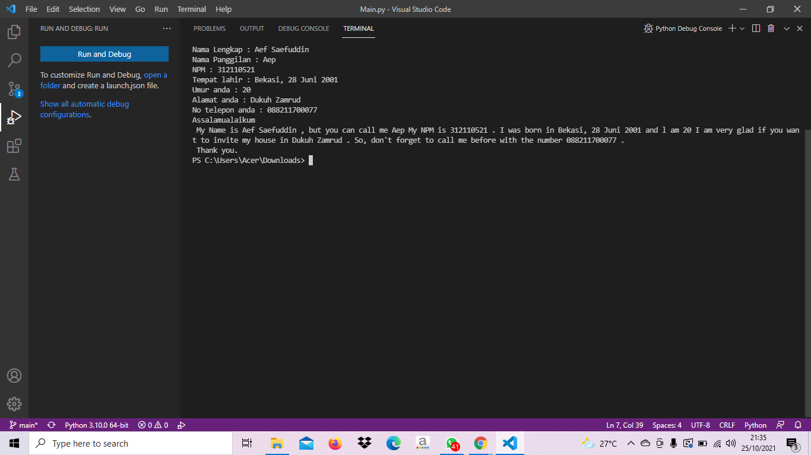

# **Tugas Pemrograman**

```sh
Nama    : Aef Saefuddin
Nim     : 312110521
Kelas   : TI.21.C5
Matkul  : Pemrograman
```

# **Latihan**
Cara Menginputkan Data Diri dan Pekenalan Menggunakan *Python*.

## *Syntax*
Dibawah Ini adalah *Syntax* atau pemrograman bagaimacara menginputkan *Data*.

```sh
namalengkap = input("Nama Lengkap : ");
namapanggilan = input("Nama Panggilan : ");
npm = input("NPM : ");
tempatlahir = input("Tempat lahir : ");
umur = input("Umur anda : ");
alamat = input("Alamat anda : ");
telepon = input("No telepon anda : ");


print("Assalamualaikum \n", "My Name is", namalengkap, ", but you can call me", namapanggilan, "My NPM is", npm, ". I was born in", tempatlahir, "and l am", umur, "I am very glad if you want to invite my house in", alamat, ". So, don't forget to call me before with the number", telepon, ".\n Thank you.");
```

## *Output*
Ketika Kita Sudah Memasukan Data-data yang Diinginkan selanjutnya kita *Run* lalu kita masukan Data Diri Kita. Maka Tampilannya Seperti yang Ada Dibawah Ini.



## **Sekian dan Terima Kasih**